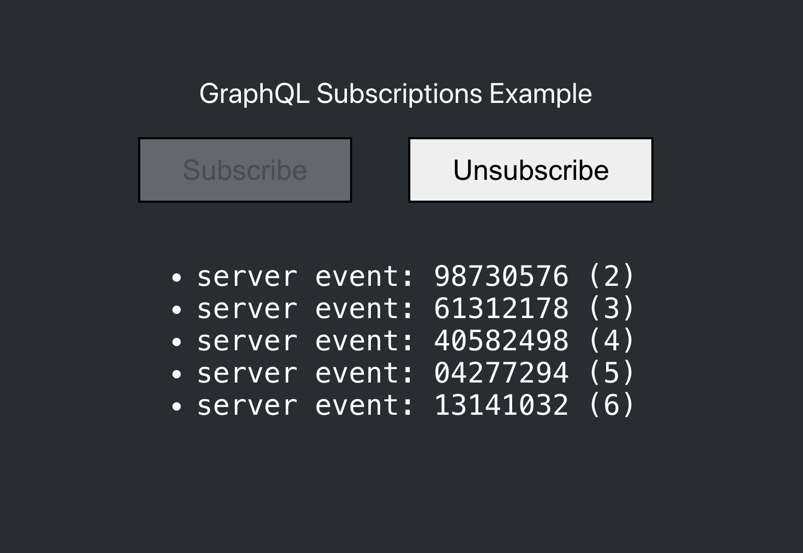

# GraphQL Subscriptions Example

A minimal Server and Client demonstrating [GraphQL Subscriptions](http://spec.graphql.org/draft/#sec-Subscription)

## Dependencies

- Server:
  - [`graphql-subscriptions`](https://github.com/apollographql/graphql-subscriptions)
  - [`subscriptions-transport-ws`](https://github.com/apollographql/subscriptions-transport-ws)

- Client:
  - `apollo-client`
  - `apollo-link-ws`

## Scripts

### `yarn start:server`

Run server

### `yarn start`

Runs the app in the development mode. 
Open [http://localhost:3000](http://localhost:3000) to view it in the browser.

### `yarn build`

Builds the app for production to the `build` folder. 
